# Zimways Food Delivery Management System

## 👥 Student Information
- **Name:** Kirenga Joe Bright  
- **Student ID:** 25823

## 📝 Problem Statement

The **Zimways Food Delivery Management System** aims to improve product delivery in Zimbabwe by providing a secure and reliable platform for transactions between customers and vendors.

### Key Requirements
- Prevent table manipulations (`INSERT`, `UPDATE`, `DELETE`) during weekdays (Monday to Friday) and public holidays
- Implement PL/SQL-based auditing mechanism to log operations
- Enforce business rules and maintain data integrity
- Track user activities with detailed audit logs

## 📊 Database Implementation

### Core Components

#### 1. Audit Logging System
The system implements a comprehensive audit logging mechanism through the `audit_pkg` package:

```sql
CREATE OR REPLACE PACKAGE audit_pkg AS
    PROCEDURE log_item_action(
        p_user    VARCHAR2,
        p_op      VARCHAR2,
        p_status  VARCHAR2,
        p_message VARCHAR2
    );
END audit_pkg;
```

**Key Features**:
- Real-time operation logging
- User action tracking with timestamps
- Status and message recording
- Secure audit trail maintenance

**Implementation Details**:
- Logs are stored in `Item_Audit_Log` table
- Each log entry captures:
  - User ID
  - Action timestamp
  - Operation type
  - Status
  - Detailed message

#### 2. Business Rules Enforcement
The system implements business rules through triggers to:
- Restrict operations during weekdays and holidays
- Validate data modifications
- Maintain data integrity
- Generate audit trails

**Implementation**:
The system uses a compound trigger `item_security_audit_trg` to enforce restrictions:

```sql
CREATE OR REPLACE TRIGGER item_security_audit_trg
FOR INSERT OR UPDATE OR DELETE ON Item
COMPOUND TRIGGER
    -- Variables for tracking
    v_day VARCHAR2(10);
    v_today DATE := TRUNC(SYSDATE);
    v_holiday_count NUMBER;
    v_user VARCHAR2(100);
    v_status VARCHAR2(10);
    v_message VARCHAR2(255);
    v_op VARCHAR2(10);

    BEFORE STATEMENT IS
    BEGIN
        -- Check weekday and holiday restrictions
        SELECT TO_CHAR(v_today, 'DY', 'NLS_DATE_LANGUAGE=ENGLISH') INTO v_day FROM dual;
        SELECT COUNT(*) INTO v_holiday_count FROM Holidays WHERE holiday_date = v_today;
        v_user := SYS_CONTEXT('USERENV', 'SESSION_USER');

        -- Enforce restrictions
        IF v_day IN ('MON', 'TUE', 'WED', 'THU', 'FRI') THEN
            v_status := 'DENIED';
            v_message := 'Blocked: DML not allowed on weekdays.';
            RAISE_APPLICATION_ERROR(-20001, v_message);
        ELSIF v_holiday_count > 0 THEN
            v_status := 'DENIED';
            v_message := 'Blocked: DML not allowed on public holidays.';
            RAISE_APPLICATION_ERROR(-20002, v_message);
        ELSE
            v_status := 'ALLOWED';
            v_message := 'DML operation permitted.';
        END IF;
    END BEFORE STATEMENT;

    AFTER EACH ROW IS
    BEGIN
        -- Log the operation
        v_op := CASE 
            WHEN INSERTING THEN 'INSERT'
            WHEN UPDATING THEN 'UPDATE'
            WHEN DELETING THEN 'DELETE'
        END;
        
        audit_pkg.log_item_action(v_user, v_op, v_status, v_message);
    END AFTER EACH ROW;
END item_security_audit_trg;
```

**Key Features**:
- Compound trigger structure for efficient processing
- Real-time weekday and holiday validation
- Automatic audit logging of all operations
- User context tracking
- Clear error messages for restricted operations

**Security Features**:
- Operation restrictions during business hours
- Automatic audit trail generation
- User action tracking
- Data modification validation

## 📸 Implementation Screenshots

### User Interface Flow
1. **User Authentication**
   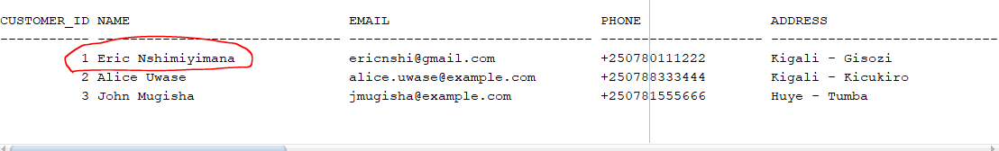
   *User interface showing a random customer that we'll use to carry out an order*

2. **Product Selection**
   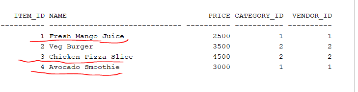
   *the vendor chooses the highlighted items*

3. **Cart Management**
   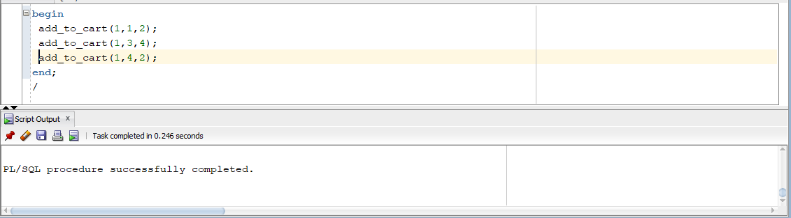
   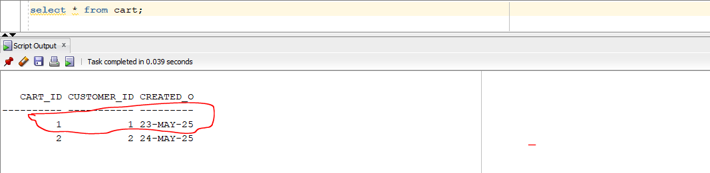
   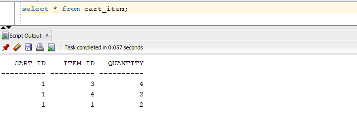
   *Cart management process showing item addition and cart items after addition*

4. **Order Processing**
   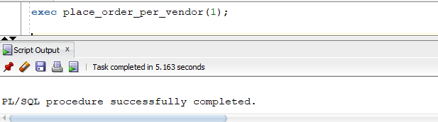
   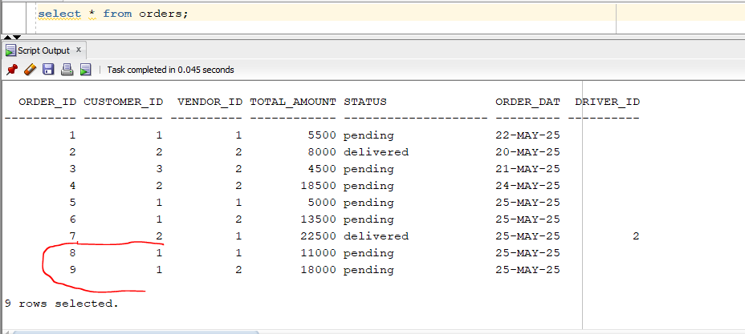
   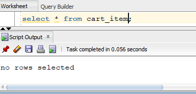
   *Complete order placement flow*

5. **Payment and Delivery**
   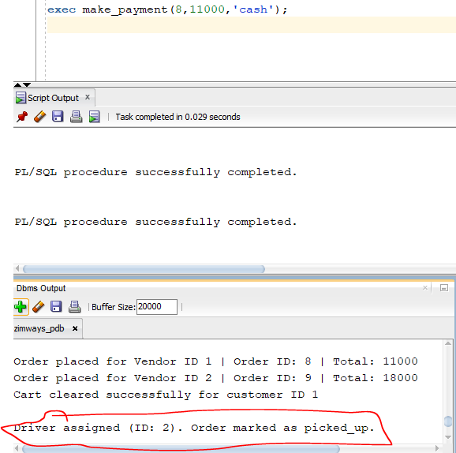
   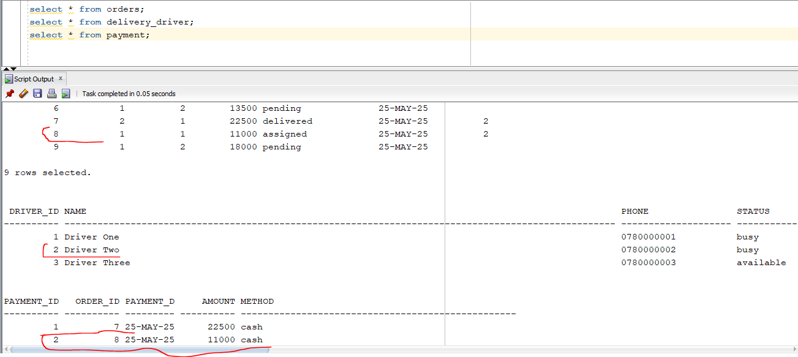
   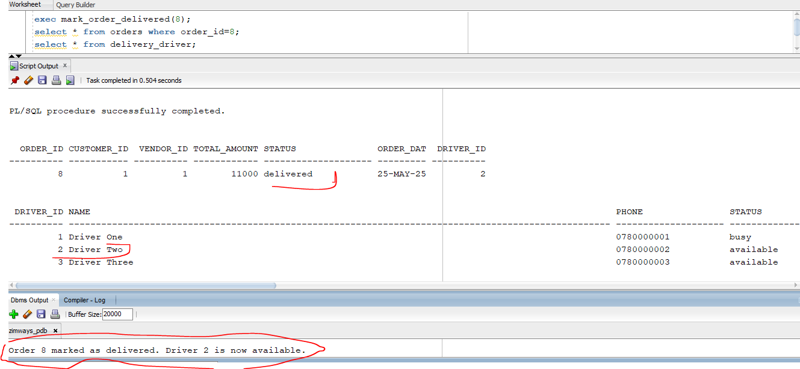
   *Payment processing and delivery confirmation*

### Database Design
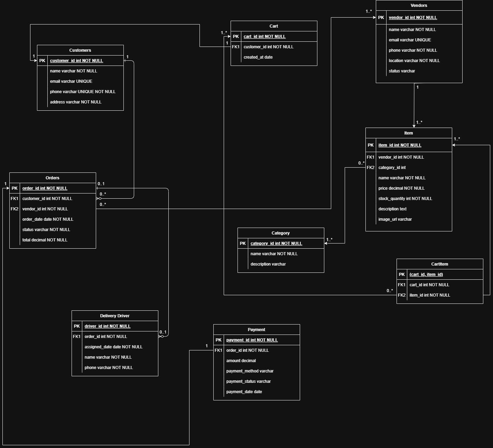
*Database entity relationship diagram*

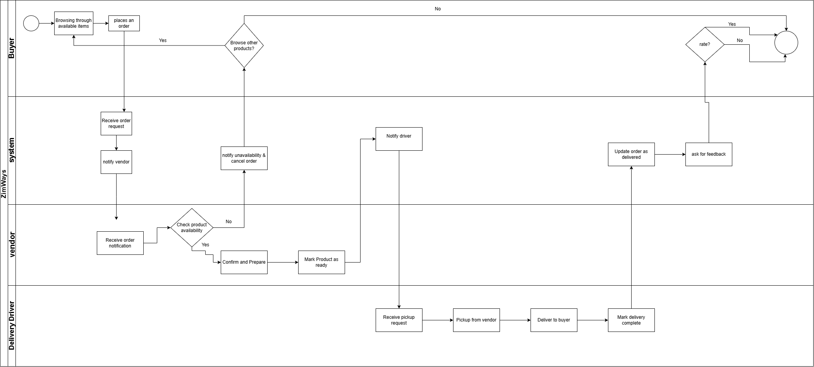
*System business model diagram*

## 📁 Project Structure
```
sql_queries/
├── packages/      # Contains audit_pkg for logging
├── triggers/      # Business rules and restrictions
├── procedures/    # Business logic procedures
├── ddl/          # Table definitions
├── dml/          # Data operations
└── window_functions/  # Analytical queries
```

## 🔒 Security Features
- Restricted operations during weekdays and holidays
- Comprehensive audit logging
- Data integrity enforcement
- User activity tracking